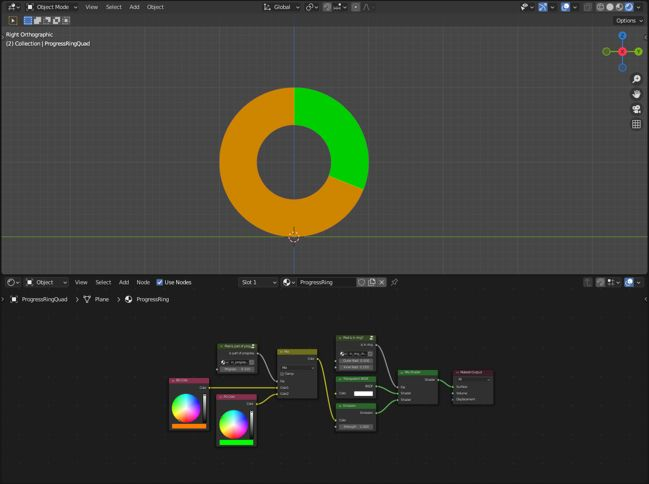

# Year of Unity - July: Progress Ring Shader

  

Not a game this time! I spent the month playing around with some shader graph stuff in Unity and then eventually decided to create a simple demo file along with a 'how-to' write up for one of them: a 'progress ring' shader. As this isn't a game, the code contained in this repo is just a very simple demo of the completed shader, along with the corresponding shader graph file.

Just for fun, I also included a Blender version, which uses Blender's shading nodes to implement the same effect (albeit in a slightly different way owing to the differences between the two node systems).

  

## Goals
Unlike previous entries, the goal here was more to experiment with shaders _in general_ rather than doing anything too specific to Unity (aside from using Unity's [shader graph](https://unity.com/features/shader-graph) system to implement things).

#### Procedural Rendering
I really like the idea of procedural rendering, but it's sort of difficult to get started with. The progress ring was actually something I did for my previous ([Hextris](https://github.com/heyoeyo/YoU_04_Hextris)) entry, though I fumbled through the implementation there. Trying to explain how it worked through a write-up forced me to better understand the details of what I had come up with. It also helped with cleaning up the implementation. I'm hoping some of the ideas for handling shapes and positioning may come in useful for other procedural systems in the future.

#### Writing
Something I feel I've _desperately_ missed over the past few years is writing up technical explanations of things, something I used to do all the time in school. Even when I feel very comfortable with a topic, trying to explain things in writing inevitably exposes gaps in my understanding. In reality, I don't normally _like_ writing, but I can't deny how helpful it seems to be for me, and so this project has been an excuse to get back to that.

#### Website/Blog Setup
Speaking of writing, I didn't just keep it to myself, I set up a website! I'm still quite surprised by this. The write up is available [here](https://www.litfamiliar.com/posts/progressring/) and includes some interactive elements.
